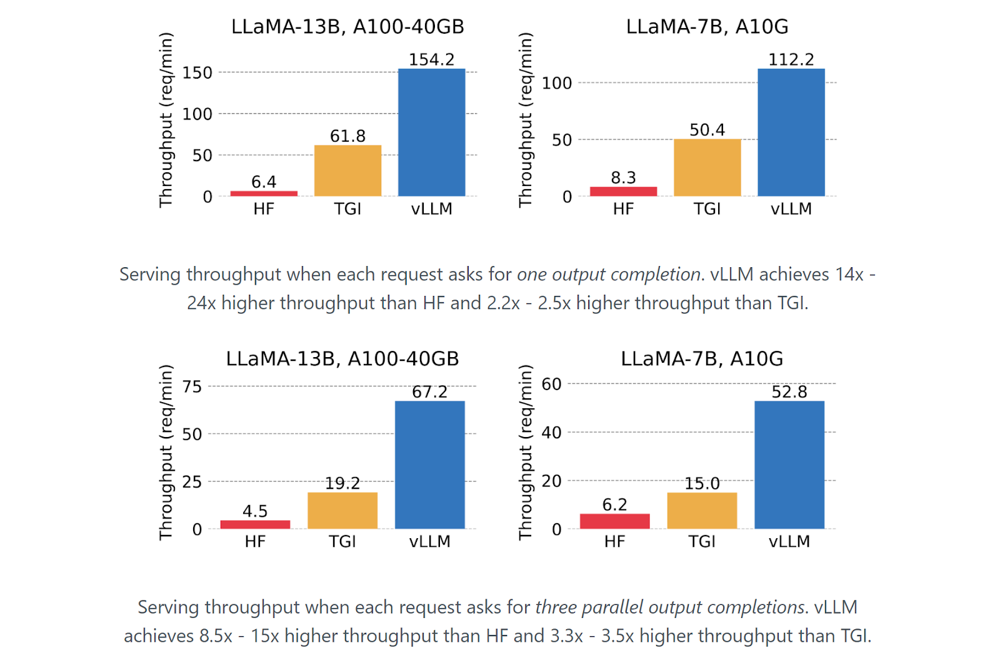
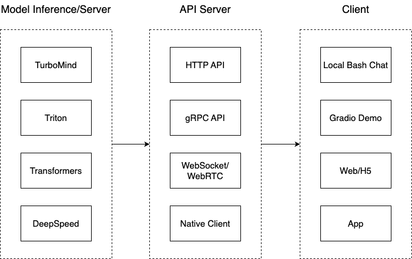

# 9.2 批处理

同样的例子，

举例：
多个用户同时输入：

用户A：“你好，今天的天气怎么样？”
用户B：“请问现在几点了？”
用户C：“能推荐一本好书吗？”

涉及在实际执行推理操作之前，将多个查询整合成一个大批次的请求统一处理，这样就提升了系统整体的处理能力（吞吐量）。


## 静态批处理 (Static Batching)


> 经典图：一个 batch 由 S1-4 这四个请求组成，这里上下文长度是 8，那四个请求一共分配 $4 \times 8 = 32$ 块内存， 

可以看到，序列3在第二次迭代后就完成了，但由于静态批处理的限制，GPU 需要等到所有序列都完成后才能继续处理。

相比之下，动态批处理机制作为动态批处理的一个特例，展现出更高的灵活性。

## 动态批处理（Continuous Batching）
也被称为持续批处理


Orca 论文中采用迭代级调度而不是等待批处理中每个序列完成生成，其中批处理大小由每次迭代确定。这样的好处是，一旦批处理中的一个序列完成生成，就可以插入新序列以取代它，从而比静态分批实现更高的GPU利用率。


## vLLM

[https://github.com/vllm-project/vllm](https://github.com/vllm-project/vllm)

vLLM 是一个推理服务，采用 PagedAttention 技术管理 kv-cache ，使其推理效率相比 Hugging Face Transformers 的实现提升了24倍。



### 重温 kv-cache

在训练过程中，Attention 机制会计算查询（Q）、键（K）和值（V）矩阵的所有元素之间的关系。这意味着模型会使用**完整的 QKV 矩阵** 来计算注意力分数和加权和，从而生成所有可能的 next token。


而在推理过程中我们只关心预测 next token，为了提高效率，只需要计算当前最尾的一个查询向量（Q[-1]）与所有的键向量（K[:]）和值向量（V[:]）之间的关系。通过计算好的 k 和 v 值，我们可以用空间换时间。


### 内存碎片化

内存碎片化（Memory Fragmentation）是指在内存分配过程中由于内存块的大小和使用方式不均匀，导致的内存浪费问题。

在实际应用中，为了应对模型支持的最大输入序列长度（例如 2,048），内存被过度预留。即使实际请求的大小可能远小于 2,048，系统依然会预留 2,048 的内存空间。这种预留的内存空间在整个请求的生命周期内被保留，导致内存浪费。特别是在高并发情况下，多个请求的内存需求可能变化较大，这种浪费和碎片化问题变得更加明显。

### 分页内存管理

而分页（Paging） 是操作系统的一种内存管理技术，可以有效减少内存碎片。

具体来说，分页技术将内存分成固定大小的块，称为“页”（pages）。这些页可以在需要时从磁盘加载到物理内存中，而不必一次性加载整个程序。这就像你需要看某个章节时，再从书架上拿下这本书。这样，操作系统能够更好地管理内存，**减少内存碎片**问题（碎片指的是内存中没有被充分利用的部分）。

### PagedAttention


这样的思想下，我们把前面所说的页称作块（block），把字节看作 token，把进程看作序列。


> “预留”（reserved）表示为未来使用而预留的内存，这些内存在整个请求期间被保留。
“内部碎片”（internal fragmentation）发生是因为难以预测生成过程的长度，因此内存被过度预留以应对最大序列长度。
“外部碎片”（external fragmentation）表示由于批处理中的请求需要不同的预分配大小而导致的低效问题。

| Block | 内容                    | 状态                                        |
|-------|-----------------------|--------------------------------------------|
| Block 1 | Four, Score, and, Seven| 完整使用，无碎片                            |
| Block 2 | years, ago, our, <空闲>| 内部碎片化，最后一个槽位未使用                |
| Block 3 | you, only, live, <空闲> | 内部碎片化，最后一个槽位未使用                |
| Block 4 | <空闲>, <空闲>, <空闲>, <空闲>| 完全未使用，没有产生外部碎片              |

可以看到分页后，外部碎片被消除了，原先 2,038 + 507 的内部碎片只剩 1 + 1，内存浪费只会发生在最后一个块中，十分接近最优利用率。
。


> 序列生成示例，每个块内部的数据是连续存储的，而通过块表的索引，不同的块又可以分散地存储在内存中。


### 使用示例（待完善）

TODO: vllm with webui(gradio, streamlit or openwebui)

官方示例：
```sh
$ pip install vllm
```

```python
from vllm import LLM

prompts = ["Hello, my name is", "The capital of France is"]  # Sample prompts.
llm = LLM(model="lmsys/vicuna-7b-v1.3")  # Create an LLM.
outputs = llm.generate(prompts)  # Generate texts from the prompts.
```

```sh
$ python -m vllm.entrypoints.openai.api_server --model lmsys/vicuna-7b-v1.3
```

```sh
$ curl http://localhost:8000/v1/completions \
    -H "Content-Type: application/json" \
    -d '{
        "model": "lmsys/vicuna-7b-v1.3",
        "prompt": "San Francisco is a",
        "max_tokens": 7,
        "temperature": 0
    }'
```

## LMDeploy（动手实践）

LMDeploy 由 MMDeploy 和 MMRazor 团队联合开发，是涵盖了 LLM 任务的全套轻量化、部署和服务解决方案。



### TurboMind

TurboMind 推理框架的构造如下：

```txt
┌─────────────────────────────────────────────────────────────────────┐
│                                API                                  │
└───────────────────────────────┬─────────────────────────────────────┘
                                │
              ┌─────────────────┴─────────────────┐
              │                                   │
              ▼                                   │
┌─────────────────────────────┐         ┌─────────┴─────────┐
│     Contunious Batch        │ ◄─────► │   KV Cache 管理器  │
└─────────────┬───────────────┘         └───────────────────┘
              │
              │
              ▼
┌─────────────────────────────┐
│  LLaMa Inference Implement  │
├─────────────────────────────┤
│   FT kernels & utilities    │
└─────────────────────────────┘
```

## 参考文章

- [Mastering LLM Techniques: Inference Optimization](https://developer.nvidia.com/blog/mastering-llm-techniques-inference-optimization/)
- [vLLM: Easy, Fast, and Cheap LLM Serving with PagedAttention](https://blog.vllm.ai/2023/06/20/vllm.html)
- [Fast, Secure and Reliable: Enterprise-grade LLM Inference](https://www.databricks.com/blog/fast-secure-and-reliable-enterprise-grade-llm-inference)
